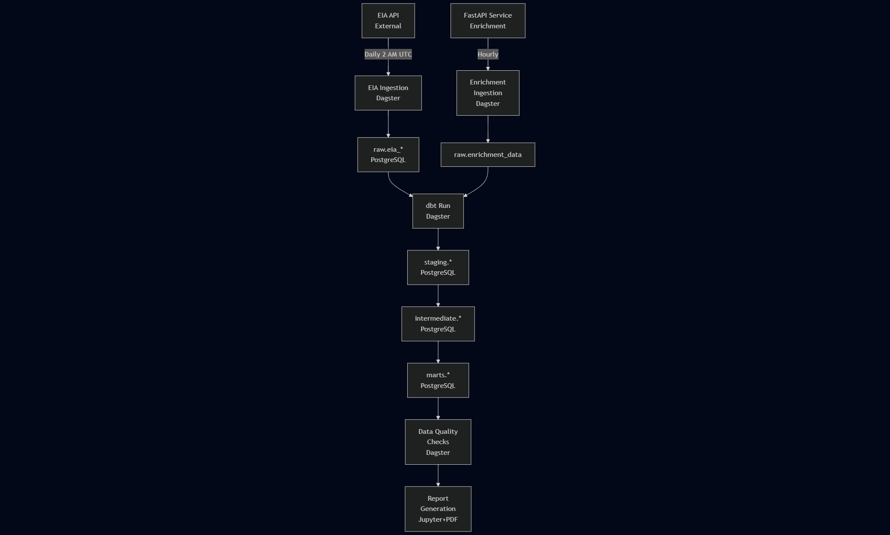

# Energy Analytics Pipeline - System Architecture

## Table of Contents

1. [Overview](#overview)
2. [System Components](#system-components)
3. [Data Flow](#data-flow)
4. [Technology Stack](#technology-stack)
5. [Database Design](#database-design)
6. [Orchestration](#orchestration)
7. [Scalability Considerations](#scalability-considerations)
8. [Security Considerations](#security-considerations)

---

## Overview

The Energy Analytics Pipeline is a production-ready data engineering system that ingests, transforms, and analyzes electricity generation data from the U.S. Energy Information Administration (EIA), enriched with weather and economic indicators. The system follows modern data engineering best practices with strict TDD, comprehensive testing, and containerized deployment.

### Key Features

- **Automated Data Ingestion**: Daily EIA API ingestion with rate limit handling
- **Real-time Enrichment**: Hourly weather and economic data enrichment
- **Layered Transformation**: Medallion architecture (Bronze/Silver/Gold)
- **Quality Assurance**: Automated data quality checks at each stage
- **Reporting**: Automated Jupyter notebook reports with PDF export
- **Orchestration**: Dagster-based workflow management with UI
- **Observability**: Comprehensive logging and monitoring

---

## System Components

### 1. FastAPI Enrichment Service

**Purpose**: Generate synthetic enrichment data (weather, economic indicators)

**Technology**: FastAPI + Uvicorn (Python 3.11)

**Key Features**:
- RESTful API with OpenAPI documentation
- Pydantic models for request/response validation
- Deterministic data generation (reproducible outputs)
- Health check endpoint for orchestrator
- Containerized deployment

**Endpoints**:
- `POST /enrichment` - Generate enrichment data
- `GET /health` - Health check

**Port**: 8000

### 2. Data Ingestion Layer

**Purpose**: Fetch data from external sources and write to raw schema

**Technology**: Python 3.13 + asyncio + httpx + asyncpg

**Components**:

#### EIA Client
- Async HTTP client for EIA API v2
- Exponential backoff retry logic
- Rate limit handling (429 responses)
- Custom exception hierarchy
- Context manager support

#### Enrichment Client
- Async HTTP client for FastAPI service
- Batch fetching support
- Error handling and retries
- Health check integration

#### Database Writers
- Async PostgreSQL writers using asyncpg
- Batch write optimization
- Metadata tracking (ingestion_timestamp, source)
- Raw JSON preservation
- Connection pooling

**Test Coverage**: 88%

### 3. Orchestration (Dagster)

**Purpose**: Coordinate and schedule all pipeline activities

**Technology**: Dagster 1.11 + dagster-webserver

**Assets**:
1. **eia_ingestion** - Fetch EIA data (daily)
2. **enrichment_ingestion** - Fetch enrichment data (hourly)
3. **dbt_transformation** - Run dbt models
4. **data_quality_check_raw** - Validate raw data
5. **data_quality_check_marts** - Validate marts data
6. **report_generation** - Generate Jupyter reports

**Schedules**:
- **Daily EIA Schedule**: 2 AM UTC
- **Hourly Enrichment Schedule**: Every hour

**Features**:
- Asset-based dependencies
- Automatic retry with backoff
- Metadata tracking
- Web UI (port 3000)
- PostgreSQL-backed metadata storage

### 4. Database (PostgreSQL)

**Purpose**: Store and organize data across pipeline stages

**Technology**: PostgreSQL 15-alpine

**Schemas**:

#### raw
- Stores unmodified ingested data
- Includes metadata columns
- Preserves raw JSON for auditing

Tables:
- `eia_energy_data`
- `enrichment_data`

#### staging
- Cleaned and typed data
- Light transformations only
- 1:1 relationship with raw

Tables:
- `stg_eia_energy_generation`
- `stg_energy_consumption`
- `stg_enrichment_data`

#### intermediate
- Business logic transformations
- Denormalized for performance

Tables:
- `int_energy_enriched`

#### marts
- Analytics-ready fact and dimension tables
- Star schema design
- Optimized for reporting

Tables:
- `fct_energy_metrics` (fact table)
- `dim_time` (dimension, seeded)

#### audit
- Pipeline metadata tracking
- Data quality metrics

Tables:
- `pipeline_runs`
- `data_quality_checks`

**Port**: 5432

**Storage**: Named Docker volume (postgres_data)

### 5. dbt Transformations

**Purpose**: Transform raw data into analytics-ready tables

**Technology**: dbt-core 1.10 + dbt-postgres 1.9

**Model Organization**:

```
models/
├── staging/          # Raw → Staging (cleaning, typing)
│   ├── stg_eia_energy_generation.sql
│   ├── stg_energy_consumption.sql
│   └── stg_enrichment_data.sql
├── intermediate/     # Staging → Intermediate (business logic)
│   └── int_energy_enriched.sql
└── marts/           # Intermediate → Marts (star schema)
    ├── fct_energy_metrics.sql
    └── dim_time.sql (seed data)
```

**Features**:
- Incremental models for large tables
- 131 data quality tests
- Comprehensive documentation
- Automated testing via dbt test

**Test Coverage**: 100% (all tests passing)

### 6. Report Generation

**Purpose**: Generate analytics reports with visualizations

**Technology**: Jupyter + nbconvert + matplotlib + seaborn

**Features**:
- Parameterized Jupyter notebooks
- Automated execution
- PDF export for distribution
- Comprehensive visualizations:
  - Energy generation by location
  - Renewable energy trends
  - Temperature correlation analysis
  - Economic indicator relationships
  - Summary statistics

**Output**: `reports/output/`

---

## Data Flow



---

## Technology Stack

### Languages & Frameworks
- **Python 3.13**: Modern async/await, type hints
- **FastAPI**: High-performance async web framework
- **Dagster**: Asset-based orchestration
- **dbt**: SQL-based transformations

### Data Processing
- **asyncpg**: Async PostgreSQL driver
- **httpx**: Async HTTP client
- **pandas**: Data manipulation (reports)
- **sqlalchemy**: Database abstraction

### Testing
- **pytest**: Test framework
- **pytest-asyncio**: Async test support
- **pytest-cov**: Coverage reporting
- **pytest-mock**: Mocking support

### Code Quality
- **ruff**: Fast Python linter + formatter
- **pre-commit**: Git hooks
- **Type hints**: Full coverage

### Visualization
- **matplotlib**: Static plots
- **seaborn**: Statistical visualizations
- **plotly**: Interactive charts

### Infrastructure
- **Docker**: Containerization
- **Docker Compose**: Multi-container orchestration
- **PostgreSQL 15**: Database
- **uv**: Fast Python package manager

---

## Database Design

### Schema Strategy

The database follows a **Medallion Architecture** (Bronze/Silver/Gold):

1. **Bronze (raw)**: Unmodified ingested data with full audit trail
2. **Silver (staging, intermediate)**: Cleaned, typed, business logic applied
3. **Gold (marts)**: Analytics-ready star schema

### Star Schema (Marts)

#### Fact Table: `fct_energy_metrics`
- **Grain**: One row per time period per location
- **Measures**: total_generation_mwh, renewable_percentage, avg_temperature_f, etc.
- **Foreign Keys**: time_id (→ dim_time)

#### Dimension Table: `dim_time`
- **Grain**: One row per date
- **Attributes**: date, year, month, quarter, day_of_week, is_weekend
- **Seeded**: Pre-populated with 11 years of dates (2014-2024)

### Indexing Strategy

Indexes are created on:
- Primary keys (all tables)
- Foreign keys (fact tables)
- Time columns (for range queries)
- Location columns (for filtering)

### Data Retention

- **raw**: Retained indefinitely (audit trail)
- **staging/intermediate**: Rebuilt from raw as needed
- **marts**: Historical data retained
- **audit**: 90-day rolling window

---

## Orchestration

### Asset Dependencies

See Dagster UI 

### Schedule Strategy

1. **Daily Batch (2 AM UTC)**:
   - EIA ingestion (respects rate limits)
   - Triggered by cron schedule

2. **Hourly Updates**:
   - Enrichment ingestion
   - Triggered every hour

3. **On-Demand**:
   - dbt transformations (after ingestion)
   - Reports (after quality checks)
   - Triggered by asset dependencies

### Error Handling

- **Retries**: Exponential backoff (3 attempts)
- **Alerts**: Log errors with context
- **Graceful Degradation**: Continue pipeline if non-critical failures
- **Audit Trail**: Record all runs in audit schema

---

## Scalability Considerations

### Current Scale
- **Data Volume**: ~10K records/day
- **Query Performance**: <1s for most reports
- **Storage**: ~100MB/year

### Horizontal Scaling

1. **Database**:
   - Read replicas for reporting
   - Partitioning by time (if >10M rows)
   - Connection pooling (already implemented)

2. **Ingestion**:
   - Parallel fetching per location
   - Batch size optimization
   - Rate limit distribution

3. **dbt**:
   - Incremental models (already used)
   - Thread count tuning
   - Model-specific scheduling

4. **Dagster**:
   - Distributed execution (Celery backend)
   - Asset partitioning by location/date
   - Dynamic resource allocation

### Performance Optimizations

- **Async I/O**: All network and database operations
- **Batch Processing**: Bulk inserts (100-1000 rows)
- **Incremental Models**: Process only new data
- **Query Optimization**: Indexes on hot paths
- **Connection Pooling**: Reuse database connections

---

## Security Considerations

### Secrets Management
- **Environment Variables**: API keys, passwords
- **No Hardcoded Secrets**: Consider a vault
- **.gitignore**: Excludes .env, credentials

### Network Security
- **Docker Network**: Isolated bridge network
- **No Exposed Credentials**: All communication internal
- **HTTPS**: External API calls only

### Data Security
- **Input Validation**: Pydantic models
- **SQL Injection Prevention**: Parameterized queries
- **Rate Limiting**: Prevents Denial of Service (DoS)
- **Audit Logging**: Full activity trail

### Authentication
- **API Keys**: EIA API (from environment)
- **Database**: Password-based (from environment)

### Future Enhancements
- **OAuth 2.0**: For API authentication
- **Role-Based Access Control**: Database permissions
- **Encryption at Rest**: Database encryption
- **TLS/SSL**: All network communication
- **Secrets Vault**: GitHub Secrets, Azure Key Vault, AWS Secrets Manager

---

## Deployment

### Development
```bash
make setup   # Install dependencies
make run     # Start services
make test    # Run tests
```

### Production Considerations

1. **Environment Variables**:
   - Secure secrets management
   - Different configs per environment

2. **Monitoring**:
   - Dagster UI for pipeline status
   - Database query monitoring
   - Application logs (Docker logs)

3. **Backup Strategy**:
   - Daily database backups
   - Volume snapshots
   - Off-site backup storage

4. **High Availability**:
   - Database replication
   - Load-balanced API services
   - Health checks and auto-restart

---

## Testing Strategy

### Test Coverage: 88%+

- **Unit Tests**: 102 tests (100% passing)
- **Integration Tests**: 27 tests (database required)
- **End-to-End Tests**: 8 tests (full pipeline)
- **dbt Tests**: 131 tests (100% passing)

### TDD Approach
- Tests written before implementation
- Minimum 80% coverage requirement
- 100% coverage for critical paths

---

## Future Enhancements

1. **Machine Learning**:
   - Energy demand forecasting
   - Renewable capacity optimization
   - Anomaly detection

2. **Real-Time Processing**:
   - Streaming ingestion (Kafka)
   - Real-time dashboards
   - Alert system

3. **Advanced Analytics**:
   - Time series forecasting
   - Causal inference
   - What-if scenarios

4. **Data Quality**:
   - Great Expectations integration
   - SLA monitoring
   - Automated data profiling

5. **DevOps**:
   - CI/CD pipeline (GitHub Actions)
   - Infrastructure as Code (Terraform)
   - Kubernetes deployment
